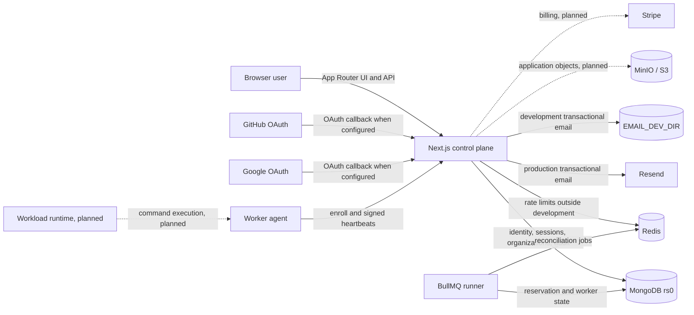
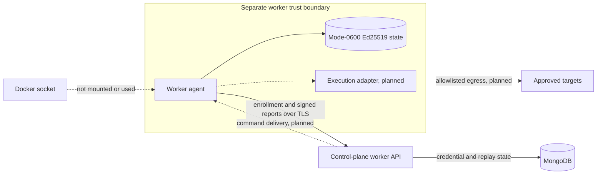
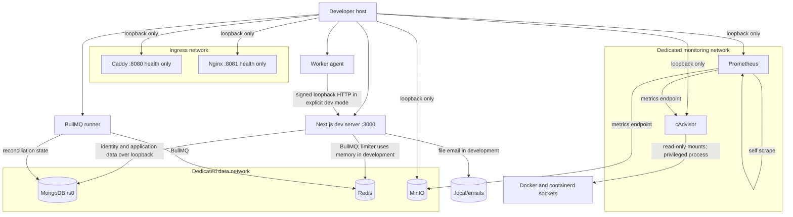

# Architecture

## Phase 2 Scope

The current control plane is a host-run Next.js App Router application with React server and client components. In addition to identity and organization flows, it implements persisted projects and environments, service-template catalog reads and drafts, entitlement reads, atomic resource reservations, a global worker inventory, and operational dashboard views.

The server uses Auth.js for credentials, magic-link, GitHub, and Google authentication. MongoDB stores identity, revocable application sessions, organizations, projects, environments, manifests, drafts, entitlements, reservations, workers, credentials, replay records, outbox events, audits, and email deliveries. Multi-record resource and organization writes use transactions. Redis backs distributed rate limiting outside development and BullMQ in every environment. Transactional email uses Resend in production or mode-`0600` files under `EMAIL_DEV_DIR` in development.

The Docker Compose stack supplies an authenticated single-member MongoDB replica set, authenticated Redis, MinIO, two independent ingress baselines, Prometheus, and cAdvisor. The application runs on the host and reaches local data services through loopback-published ports. Caddy and Nginx expose only `/healthz` and do not proxy the application.

MinIO is operational local infrastructure but no application object-storage workflow uses it. A separate worker agent enrolls and sends signed heartbeats, while a separate BullMQ runner reconciles stale reservations and workers. Workload provisioning, command delivery and execution, Stripe billing, Vault resolution, product backups, and domain management remain planned.

## Control Plane

Solid arrows are implemented code paths. Dashed arrows are deferred boundaries without a Phase 2 product implementation.

Password and magic-link authentication are also implemented inside the browser-to-control-plane path. GitHub and Google code paths are present but are enabled in the UI only when each provider's credentials are configured.

## Identity and Authorization

Auth.js issues JWT-backed login sessions. On sign-in, the application also creates a MongoDB `AppSession` carrying a random session ID, user token version, provider, hashed source address, user agent, activity time, expiry, and revocation state. Authenticated server operations validate both the Auth.js session and the `AppSession`; a password reset increments the user token version and revokes all application sessions.

Credentials registration hashes passwords with Argon2id. Verification, password-reset, invitation, and Auth.js magic-link tokens are persisted by digest and have expirations. GitHub and Google sign-in requires the provider to attest a verified email, and dangerous email-based account linking is disabled.

Organizations create five built-in roles and an owner membership in one transaction. API authorization resolves the active membership and role on the server for every organization-scoped operation. Role assignment prevents permission escalation, membership updates use optimistic versions, and last-owner checks protect ownership continuity.

## Worker Plane

Phase 2 implements worker identity and health reporting, not workload execution. Enrollment exchanges a one-use bearer token for a unique Ed25519 credential. Subsequent heartbeat, result, and credential-rotation requests sign a canonical method/path/timestamp/nonce/body envelope; nonce consumption and credential state are persisted in MongoDB. HTTPS is mandatory except explicit loopback development mode.

Workers initiate outbound requests and use per-worker identities. The included agent reports real host capacity and health but has no command receiver, result sender, secret delivery, sandbox, or container-runtime integration. A result endpoint and control-command signing primitive exist for the later delivery path; neither provisions a workload. See [worker security](worker-security.md).

## Local Components

Data, ingress, and monitoring use separate bridge networks. All published infrastructure ports bind to `127.0.0.1`. The app is not attached to those Docker networks, and neither ingress baseline has an application route.

## Persistence and Initialization

Named volumes hold MongoDB, Redis, MinIO, Prometheus, and the Mongo replica key. `mongo-keyfile-init` creates an owner-only key once and refuses an unexpected replacement. `mongo-rs-init` safely initiates `rs0`, waits for a writable primary, and upserts only the technical database user. `minio-init` creates only the configured private bucket.

Application records are created by real account and organization flows. The bootstrap scripts do not create product users, organizations, activity, or other fake business records.

No worker command transport, workload runtime, provisioning engine, Stripe integration, Vault integration, product backup/restore flow, domain management, outbox relay, or application use of MinIO is present in Phase 2. Declared queue names and persisted desired state are contracts for later phases, not claims that those processors exist.
